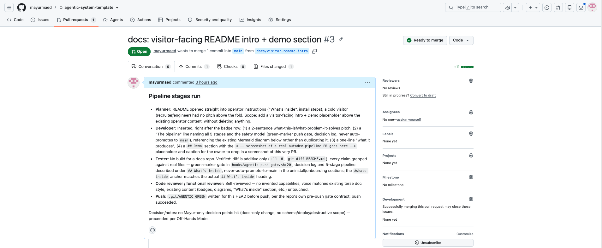
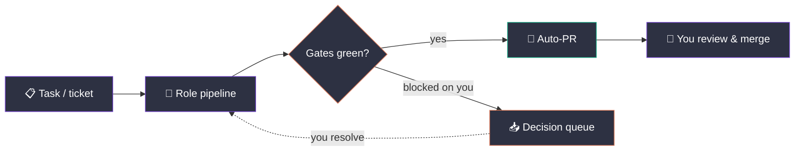
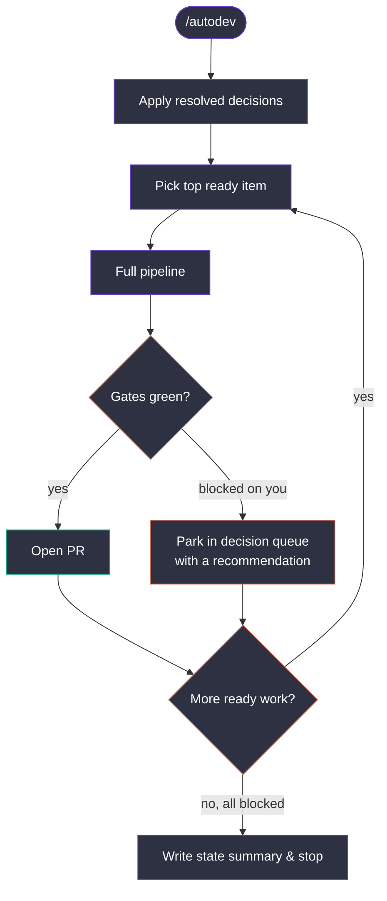

# Claude Agentic System (template)

[](LICENSE)
[](https://claude.com/claude-code)
[](https://github.com/openai/codex-plugin-cc)
[](#autonomous-development-autodev)

An operating layer that runs an autonomous dev pipeline — planner, developer, tester, reviewer, push — across Claude Code and Codex, so routine implementation work ships as reviewed pull requests without hand-holding. Point it at a ticket or backlog item; it plans, writes, tests, reviews, and opens the PR itself.

> [!WARNING]
> This system runs autonomous agents with a GitHub token that can push, and its scheduled runner resets and cleans its working clone. Read [SECURITY.md](SECURITY.md) before installing it or enabling cron runs.

**The pipeline:** `planner → developer → tester → code reviewer → functional reviewer → push` (diagrammed below, detailed under [What's inside](#whats-inside)). Safety model: a pre-push hook blocks any push without a green marker written only after gates pass, every decision is appended to a decision log, and nothing ever auto-promotes to `main` — every PR waits for your review and merge.

**What it produces:** scheduled `/autodev` ticks turn backlog items into reviewed PRs, one work item per run.

## Demo


*A PR opened by this exact pipeline, planned/built/tested/reviewed with no manual intervention until merge.*

A fork-and-fill template for an off-hands agentic operating layer on Claude Code: tiered model selection, self-qualifying delegation loops, a role pipeline, decision advisors, an append-only decision log, and Off-Hands Mode as the default. One `install.sh` run makes any machine behave the same.

**Before you install:** macOS only (the scripts use `caffeinate`, `osascript`, and Homebrew paths), plus the GitHub CLI (`gh`) and Python 3. Beyond that you need **at least one of** [Claude Code](https://claude.com/claude-code) or the [Codex CLI](https://github.com/openai/codex) — the system runs on either alone, or both together. Run `./install.sh` for the Claude track, `./install-codex.sh` for the Codex track, or both. See [Requirements](#requirements).

**Cost:** this drives Claude Code and/or Codex, both paid, and the scheduled runner invokes them on a cron — by default every 30 minutes per onboarded project. Pick the frequency at onboarding with `./onboard-autodev.sh --every <minutes>`. Check your plan's usage limits before enabling cron.

Fork it, skim the instructions in `claude/CLAUDE.agentic.md` (they refer to "the owner" — that's you), adjust the always-approve list and Jira/Confluence references to your stack, then run `./install.sh`. Generated from a private live setup; decision logs and machine data are never part of this repo.



*You point it at a task or ticket. It runs the pipeline unattended. Green gates become a PR waiting for your merge; anything only you can decide gets parked with a recommendation instead of blocking everything else.*

## What's inside

- `claude/CLAUDE.agentic.md` — the baseline instructions, installed as a marked block in `~/.claude/CLAUDE.md`:
  - **Codex delegation policy** — delegate all file I/O/implementation to Codex; model tiers Sol/Terra/Luna × reasoning effort, cheapest that plausibly succeeds.
  - **Delegation loop** — acceptance criteria in every prompt; executor self-checks with evidence; escalate effort→tier on failure (max 4), one cross-track rescue, then halt with the trail.
  - **Claude track** — same rubric when Claude executes (Haiku=Luna, Sonnet=Terra, Opus=Sol); single-loop rule (executor owns the loop, orchestrator only gates).
  - **Pipeline** — auto for implementation tasks: planner → developer → tester → code reviewer → functional reviewer → push; reviewer runs opposite-track from developer; functional-review depth scales with blast radius; green gates → auto-PR.

    ```mermaid
    flowchart LR
        P["Planner"] --> Dev["Developer"]
        Dev --> T["Tester"]
        T --> CR["Code reviewer<br/><i>opposite track</i>"]
        CR --> FR["Functional reviewer"]
        FR -- green --> Push["🚀 Auto-PR"]
        CR -. findings .-> Dev
        FR -. findings .-> Dev

        style P fill:#2d3142,color:#fff,stroke:#6e40c9
        style Dev fill:#2d3142,color:#fff,stroke:#6e40c9
        style T fill:#2d3142,color:#fff,stroke:#6e40c9
        style CR fill:#2d3142,color:#fff,stroke:#d97757
        style FR fill:#2d3142,color:#fff,stroke:#d97757
        style Push fill:#2d3142,color:#fff,stroke:#10a37f
    ```

    The reviewer running on the opposite track from the developer (Codex wrote it → Claude reviews it, or vice versa) is deliberate — a second model family catches what the author-model misses. Findings bounce back to the developer, not around it.
  - **Decision advisors & log** — persona consultations at decision forks; every decision logged append-only with D-ids in `~/.claude/decisions/<project>.md`; grep before re-asking.
  - **Involvement rule + Off-Hands Mode (default)** — fully autonomous; owner-only decisions get parked in a Pending Decisions queue with recommendation+options while unblocked work continues; check-ins present the queue first.
- `claude/agents/` — the role agents: `pipeline-planner`, `pipeline-developer`, `pipeline-tester`, `pipeline-code-reviewer`, `pipeline-functional-reviewer`, plus `decision-advisor` — a single parameterized agent carrying seven personas (Architect, Senior Developer, Junior Developer, Product Manager, Engineering Manager, Delivery Manager, CSM) consulted at decision forks; the PM and Architect personas also proactively propose features/structural work into the tracker in Off-Hands Mode.
- `claude/commands/` — the entry-point commands: `/autodev`, `/ticket`, `/task` (see below).
- `claude/rules/` — standing conventions installed into `~/.claude/rules/`: `jira.md` (status-workflow lookup, ticket key on every PR, epic linkage), `plandb.md` (when/how to use PlanDB for task decomposition and parallelism), and `output-first.md` (lead every response with the result; reasoning and caveats follow it). Add more `*.md` files here for any other cross-project convention.
- `hooks/` — mechanical enforcement: `agentic-push-gate.sh` blocks `git push` unless `.git/AGENTIC_GREEN` matches HEAD (written only after pipeline gates pass); `agentic-pending-decisions.sh` injects the pending-decisions queue into every new session. `install.sh` registers both in `~/.claude/settings.json`.

## Autonomous development: `/autodev`

In any project's Claude Code session:

```
/autodev                # detect backlog (Jira / BACKLOG.md / ROADMAP.md) or have PM draft one
/autodev PROJ           # use Jira project PROJ as the backlog
/autodev BACKLOG.md     # use a file as the backlog
```

What it does: bootstraps the project if needed (`/init` + codebase assessment), then loops — top backlog item → full pipeline → PR on green → next — until all remaining work is blocked on the owner's decisions, then writes a state summary. Re-running `/autodev` first applies any resolved decisions, then resumes. It never merges; PRs and the decision queue are the human touchpoints. To run it unattended on a schedule, use the canonical onboarding (below) — never hand-roll a per-project cron script.



## Scheduled autonomous runs (canonical onboarding)

One command schedules any project — no bespoke wrapper, clone, or token:

```bash
./onboard-autodev.sh <repo-dir> [slug] [minute-offset] [--every MINUTES] [--hook]
```

`--every` sets the cadence (default `30`, i.e. twice an hour). It must divide 60 (`5`, `10`, `15`, `20`, `30`, `60`) or be a multiple of it (`120`, `240`, `1440`); anything else is rejected rather than silently producing an irregular schedule. Omit it and you'll be prompted. The minute-offset staggers projects so they don't all fire at once — valid range is `0` to one less than the interval.

It adds a single crontab line calling the ONE shared runner (`~/.codex/automations/autodev-runner.sh`, installed by `install-codex.sh`). The runner works in its own dedicated clone — always reset clean at origin's base-branch tip, so it never collides with a dirty dev checkout — authenticates via the shared `~/.codex/secrets/github.env` token, holds a lock so ticks never overlap, and kills any run exceeding a 100-min watchdog (TERM to the whole process group, then KILL after a grace period). It runs the `/autodev-cron` prompt (resume-first, one item per tick) and notifies you when PRs await merge or when a run's diff adds a database migration that still needs a manual production apply.

**Custom scope per project:** drop a `~/.codex/automations/autodev-<slug>/prompt.md` and the runner uses it instead of the generic `/autodev-cron` (e.g. a hard ticket allowlist when several projects share one repo). **Base branch:** every repo targets a `staging` integration branch — onboarding creates `staging` from the default branch if it doesn't exist yet. PRs **never** target `main`; promoting `staging`→`main` is the owner's deliberate call. Override with `--base`.

**Hard rule (baked into both tracks): never author a per-project autopilot script, clone, or token file.** That path rots and needs triage; the shared runner is the only sanctioned mechanism. If it lacks something, extend the one runner. Prerequisite: `~/.codex/secrets/github.env` containing `GH_TOKEN=<token that can push>` (cron can't read the macOS keychain).

### Codex quota exhaustion

Codex can exhaust its usage quota for hours or days. **By default nothing happens and nothing is asked of you:** a capped tick writes one line to that lane's log and exits. The next tick after the quota resets picks up normally. There is no state to clear and no notification to dismiss.

> [!IMPORTANT]
> **The Claude-track fallback is OFF by default, and turning it on has real consequences. Read this before you enable it.**
>
> You can opt in to having capped runs continue on the Claude CLI instead of no-opping:
>
> ```bash
> touch ~/.codex/automations/claude-fallback-approved
> ```
>
> **What you are agreeing to.** The fallback invokes `claude -p --dangerously-skip-permissions`. That is an unattended agent that writes code, commits, pushes, and opens PRs with **no per-action approval prompt**. It is the same authority the Codex path already has — but it spends a *different* budget, and it bypasses Claude's per-directory trust gate. Enable it only on a machine you own, for repos you own, and only with branch protection on your default branch. Installing this template never enables it; the flag file does not exist until you create it.
>
> **Scope and lifetime.** The flag is global — one approval covers every lane on the machine. The runner **deletes it automatically** on the first tick where Codex is healthy again, so the opt-in cannot silently outlive the outage. You get a "Codex recovered" notification when that happens. To re-enable it during a later outage, `touch` it again. To make sure it can never fire even if the flag exists, set `AUTODEV_NO_FALLBACK=1` in the environment.

**Design note — why capped ticks are silent.** An earlier version fired a macOS notification asking for fallback approval. Its once-per-outage dedup marker was cleared by any lane that ran clean, so on a machine with several lanes and a partially-exhausted quota it re-asked every few minutes for an approval the owner did not want. An alert that fires repeatedly and needs no action trains you to ignore all alerts, including the two that do matter (PR awaiting merge, migration pending). Capped ticks now log and stay quiet.

## The other entry points

| Command | What it does |
|---|---|
| `/ticket PROJ-123` | One Jira ticket end-to-end: fetch → In Progress → full pipeline → PR (key in title/body) → ticket to Review → PR link commented on the ticket. Blocked gates leave the ticket In Progress with the trail logged. |
| `/task <ask>` | Any ad-hoc ask through the FULL pipeline with no trivial-task skip logic. Finds/proposes the Jira ticket the PR needs. |
| `/autodev-cron` | One scheduled tick of /autodev, shaped for short unattended runs: overlap-guarded (lock file), applies resolved decisions first, resumes in-flight work before new, exactly one run-window-sized item per tick. Use as the prompt for 30-min crons (Codex schedules or Claude routines); use plain /autodev for interactive/long sessions. |
| *(no command)* | Ordinary implementation asks already run the pipeline by default — the commands are for explicitness (`/task`), ticket flow (`/ticket`), or standing loops (`/autodev`). |

## Decision log

Canonical: `~/.claude/decisions/<project>.md` (pending queue + append-only D-entries). When the Atlassian MCP is connected, D-entries are mirrored to a "Decision Log — <project>" Confluence page; the local file always wins on conflict, and mirroring never blocks work.

### Pending-decisions ↔ GitHub Issue sync (optional, cross-project)

`scripts/pending-issue-sync.sh` (installed to `~/.codex/automations/pending-issue-sync.sh` by `install-codex.sh`) mirrors each project's `## Pending Decisions` table to a pinned "📋 Pending Decisions — `<project>`" GitHub Issue, so decisions can be answered from a phone/GitHub notification instead of a terminal. Comment `P-4: approve` (or any `P-<n>: <answer>`) on the issue and the next agent run harvests it into the decisions file's `## Answers Inbox` and applies it.

Configure which projects it covers in `~/.claude/decisions/.sync-projects` (one `slug:owner/repo` per line — copy `scripts/.sync-projects.example` to get started; `install-codex.sh` never overwrites this file once it exists, since it's per-machine config, not part of the system itself). Then cron it independently of any dev runner:

```
*/15 * * * * ~/.codex/automations/pending-issue-sync.sh >/dev/null 2>&1
```

## Setting up a new machine

1. Install [Claude Code](https://claude.com/claude-code) and the Codex CLI (`npm i -g @openai/codex`, ≥ 0.144 for the 5.6 model tiers).
2. Install the Codex connector plugin — marketplace repo: [openai/codex-plugin-cc](https://github.com/openai/codex-plugin-cc) — in Claude Code: `/plugin marketplace add openai/codex-plugin-cc`, then install the `codex` plugin from it.
3. Clone this repo and run `./install.sh`.
4. Optional: connect the Atlassian MCP (Jira tickets + Confluence decision-log mirror) via `claude mcp` or `/mcp`.

Atlassian is optional. Task/priority tracking falls back down a chain the commands all understand: **Jira (if connected) → plandb project (if the `plandb` CLI is installed) → `BACKLOG.md` at repo root**. `/autodev` pulls ready items from whichever store exists, `/ticket` accepts a plandb task id or backlog heading instead of a Jira key, and PM proposals land in the best available store — so autonomous execution works with zero external services.

Without Codex (steps 1–2 skipped), the Claude track carries all execution — degraded cost, same guarantees.

## Codex-only setup (no Claude at all, or Claude tokens exhausted)

The system also runs standalone on the Codex CLI / ChatGPT app:

```bash
./install-codex.sh
```

That stamps the Codex-track instructions (`codex/AGENTS.agentic.md`) as a marked block into `~/.codex/AGENTS.md` and installs `/autodev`, `/autodev-cron`, `/ticket`, `/task` as Codex custom prompts (`~/.codex/prompts/`). Same loop, pipeline, tracker chain, personas, and decision log (shared `~/.claude/decisions/` so both tracks see one queue on dual machines). Tier delegation happens via `codex exec -m <model>` subprocesses; code review runs in a fresh `codex exec`/`codex review` context for independence. On Codex ≥ 0.144, `install-codex.sh` also registers and trusts a native `PreToolUse` push-gate hook (`~/.codex/hooks.json` + a `trusted_hash` in `~/.codex/config.toml`) as an **optional, additive** early-warning layer for interactive Codex sessions — it's skipped automatically if Codex is absent or older. Because that hook only covers Codex's own pushes, the universal mechanical gate remains the tool-agnostic git `pre-push` hook, which also catches manual and cron pushes. Install it per repo:

```bash
scripts/install-git-prepush.sh /path/to/repo
```

It blocks any push (Codex, Claude, or manual) whose HEAD lacks the `AGENTIC_GREEN` marker. Dual-track machines can run both installers; the tracks share decisions and markers.

## Install / update (per machine)

```bash
git clone <this-repo> && cd agentic-system
./install.sh
```

Re-run `install.sh` after pulling updates — it replaces the marked block in `~/.claude/CLAUDE.md`, overwrites the agent/command/hook files, and registers the two hooks in `~/.claude/settings.json` (existing settings preserved; a `settings.json.bak` backup is written before each merge). Nothing else in `~/.claude` is touched. Requires `python3`.

> [!IMPORTANT]
> **The installers do not fail when the CLI they configure is missing — they warn.**
>
> `install.sh` writes the Claude Code config whether or not the `claude` CLI exists; `install-codex.sh` does the same for `codex`. This is deliberate: installing the config before the tool is a legitimate order, so a missing CLI is not treated as an error.
>
> The consequence: **if you miss the warning, the install looks successful and then nothing runs.** No error at cron time either — the scheduled runner simply no-ops on every tick.
>
> Both warnings are printed to **stderr at the end of the run** and look like this:
>
> ```
> WARN: claude CLI not found — config installed, but nothing will run it. Install Claude Code: https://claude.com/claude-code
> WARN: codex CLI not found — install it (npm i -g @openai/codex), or this track will no-op.
> ```
>
> You only get the warning for the track you install, and you only need the CLI for the track you install — `install.sh` never checks for `codex`, and `install-codex.sh` never checks for `claude`. A warning about the *other* track's CLI is not something you'll see.
>
> If you see the warning for a track you meant to install, install that CLI and re-run. To keep the check visible when piping or logging, don't discard stderr — `./install.sh 2>&1 | tee install.log`. To check before you start:
>
> ```bash
> command -v claude || echo "no Claude Code — skip install.sh"
> command -v codex  || echo "no Codex CLI — skip install-codex.sh"
> ```
>
> At least one must be present. Both missing means nothing will run.

## Editing workflow

Edit files **in this repo**, run `./install.sh`, commit, push. (Editing `~/.claude` directly works but drifts from the repo — sync back with `sed -n '/agentic-system:start/,/agentic-system:end/p'` if you did.)

Changing the template itself? See [CONTRIBUTING.md](CONTRIBUTING.md) for the local workflow and verification expectations.

Decision logs (`~/.claude/decisions/`) are per-machine working data and intentionally not part of this repo.

## Uninstall

Run `./uninstall.sh` to reverse both installers automatically — it removes the installed files, strips the marked blocks from `~/.claude/CLAUDE.md` and `~/.codex/AGENTS.md`, and de-registers the Claude hooks (`~/.claude/settings.json`) and the native Codex hook + its trust state (`~/.codex/hooks.json` / `config.toml`), preserving all unrelated entries and your `~/.claude/decisions/` data. Scope it with `--claude` or `--codex`, and add `--yes`/`-y` to skip the prompt. Per-repo git hooks and crontab entries are left untouched (it prints reminders). The manual steps below remain as reference:

**`install.sh` (Claude track):**
- Delete the installed files: `rm ~/.claude/agents/pipeline-*.md ~/.claude/agents/decision-advisor.md ~/.claude/commands/{autodev,autodev-cron,ticket,task}.md ~/.claude/hooks/agentic-*` (and any `~/.claude/rules/*.md` it installed).
- Remove the agentic block from `~/.claude/CLAUDE.md`: delete everything between (and including) `<!-- agentic-system:start -->` and `<!-- agentic-system:end -->`.
- Remove the two hook registrations from `~/.claude/settings.json`: the `SessionStart` entry running `agentic-pending-decisions.sh` and the `PreToolUse` (Bash) entry running `agentic-push-gate.sh`. A pre-merge backup exists at `~/.claude/settings.json.bak`.
- Timestamped backups (`*.bak.<timestamp>`) of anything the installer overwrote sit next to the originals — restore or delete as you like.

**`install-codex.sh` (Codex track):**
- `rm ~/.codex/prompts/{autodev,autodev-cron,ticket,task}.md ~/.codex/automations/{autodev-runner,install-git-prepush,pending-issue-sync}.sh ~/.codex/hooks/agentic-push-gate.{sh,py}`
- Remove the agentic block (same start/end markers) from `~/.codex/AGENTS.md`.
- Remove the owned `PreToolUse` handler (its `statusMessage` is `Checking AGENTIC_GREEN push gate`) from `~/.codex/hooks.json`, and its matching `[hooks.state."…:pre_tool_use:<group>:0"]` table (with `trusted_hash`) from `~/.codex/config.toml` — leaving all other hooks and trust tables intact.

**`onboard-autodev.sh` (per project):**
- Remove the crontab line: `crontab -l | grep -v '# autodev:<slug>' | crontab -`
- `rm -rf ~/.codex/automations/autodev-<slug>/` (state, logs, clone; a crontab backup also lives here)
- Optionally `rm ~/.claude/decisions/<slug>.md` (your decision/work log — keep it if you want the history).

**`scripts/install-git-prepush.sh` (per repo):**
- `rm <repo>/.git/hooks/pre-push` — or restore a prior hook from `<repo>/.git/hooks/pre-push.bak.<timestamp>` if one was backed up.
- `rm <repo>/.git/AGENTIC_GREEN` if present.

## Requirements

- macOS only (the scripts use `caffeinate`, `osascript`, and Homebrew paths); requires the GitHub CLI (`gh`).
- Python 3 (settings merge in `install.sh` and command parsing in the push gate — the gate fails closed without it).
- **At least one of** Claude Code or the Codex CLI. All three configurations work:
  - **Both** (recommended) — Claude Code with the Codex plugin (`codex:rescue` agent) and Codex CLI ≥ 0.144 (for the 5.6 model tiers). Delegation and opposite-track code review both available.
  - **Claude only** — run `./install.sh`. The Claude track carries all execution; delegation falls back to Claude tiers (Haiku/Sonnet/Opus).
  - **Codex only** — run `./install-codex.sh`. See [Codex-only setup](#codex-only-setup-no-claude-at-all-or-claude-tokens-exhausted). The mechanical push gate is the tool-agnostic git `pre-push` hook (also covers manual and cron pushes); Codex's own `PreToolUse` hook can add an earlier layer but isn't required.
